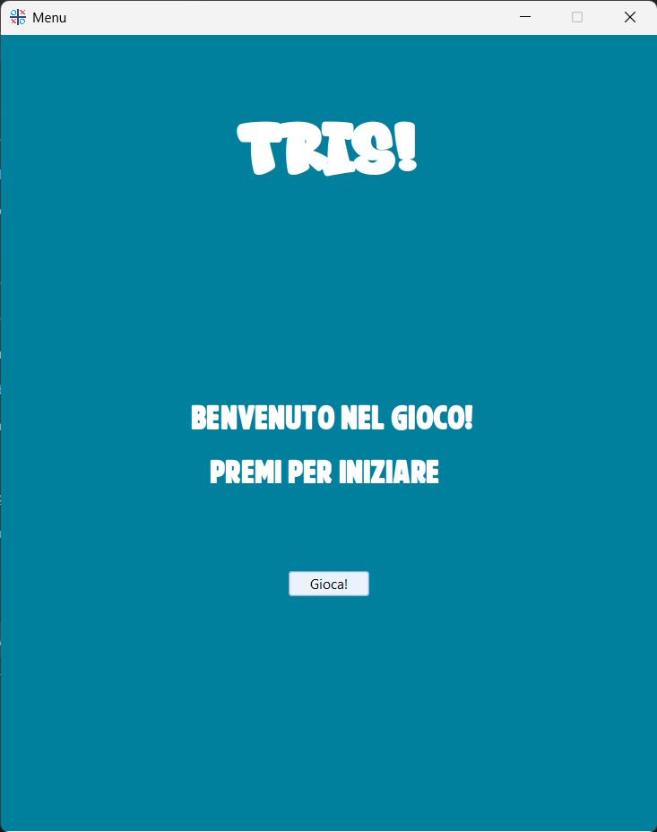
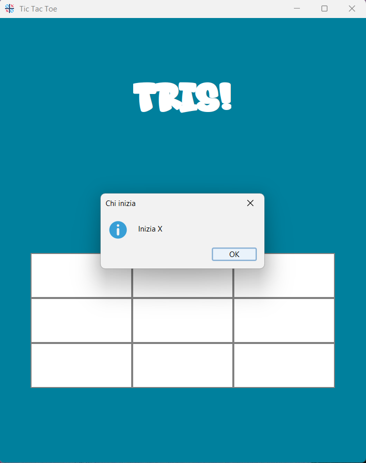
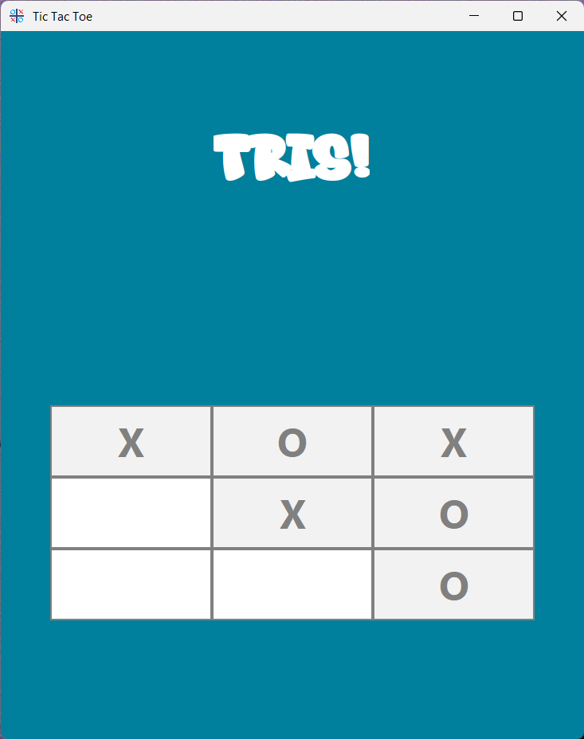
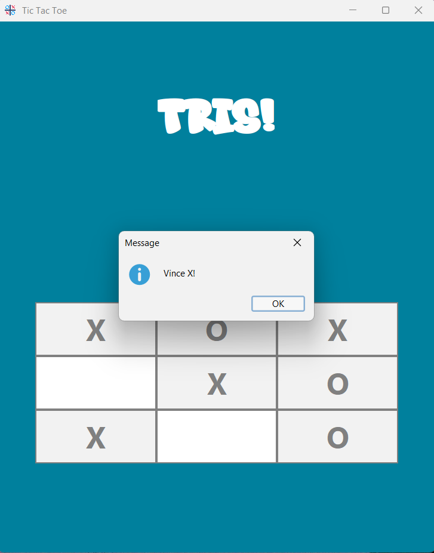
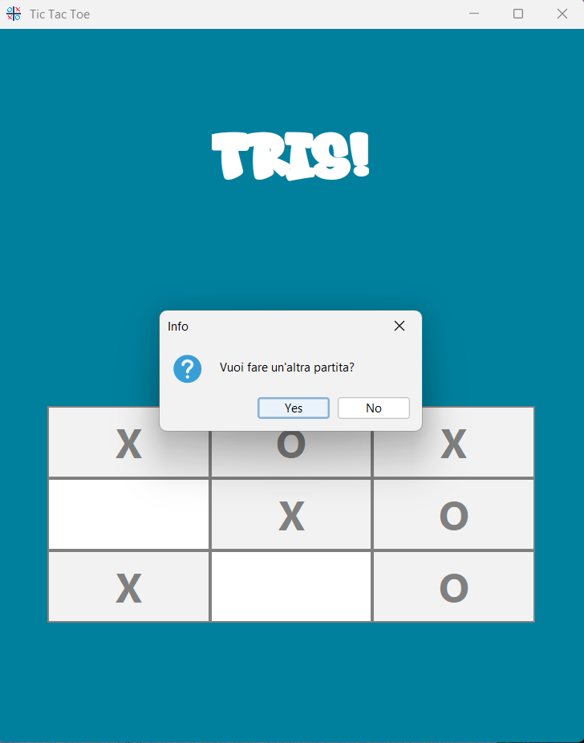

# Tic Tac Toe game

This is a Tic Tac Toe game developed in java.
It's not a multiplayer game, you can only play alone against a robot.

The "robot" has been implemented under an algorithm, which uses strategy and tries to occupy the center with its letter.
There's no letter that starts first and after finishing the match you can play again or exit the game.

### A brief documentation

The application follows a MVC architecture, which consist of three different sections: Model, View and Controller.

In the Model level we can find the file that manages to create and update the board we use in the game.

In the View section there are the files that manage the menu and the view of the game. For the graphics, the Java Swing library has been used, adding also different fonts and the FlatLaf jar to make it look more modern.

And finally, in the Controller section there is the file that controlls the actions we can make during the game.

### Game overview

The game starts with this screen:

After starting the game, you'll be notified of what letter you'll use and then start playing.

Here you can see the board during the game, that's what you see during the game.

After finishing the game you'll get the message displaying if you have won or lost.

In the end you can decide to play again or exit the game.

## Authors

- [@PixelRei](https://github.com/PixelRei)
